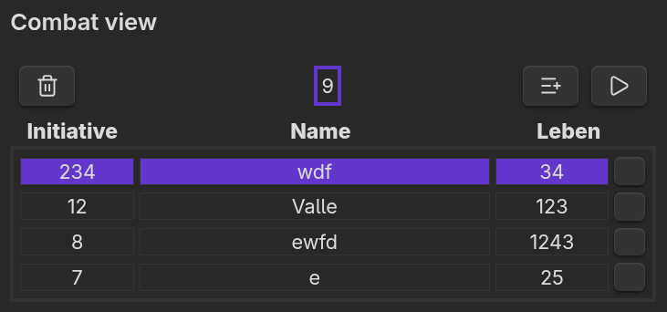

# RPG Combat Tracker

Keep track of all the friends and foes in a tabletop RPG fight. Never loose track of who's turn it is ever again. 

## Table of contents

- Description
- Features
- Motivation

## Description

This plugin is designed to help the Dungeon Master of an adventure to focus on the epic fight rather than the logistics of not forgetting who's turn it is. \
The plugin aims to make the session more enjoyable for everyone involved by making it more easy to keep track of all the members in a fight. Especially in encounters with a lot of enemies.

Whoever the Dungeon Master, they can create a Session with any number of participants. \
Every participant has the following attributes:

- Initialisation
- Name
- Health

Those all are attributes that can be set compleatly free. Changing this data is also just a double-click away. \
All actores of the fight are sorted by the ini.

## UI explained

The picture shows the side panel in which all the participants are managed. I will briefly explain all the Buttons and sections from top left to bottom right.

### Trashcan Button

This Button clears the whole view. All fight-members will be deleted from the View. There is a safety pop-up where you need to agree to delete the session.

### Round Counter

The Round Counter shows the current fighting round. It updates automatically and highlights at the beginning of every new round.

### Add Button

The 'Add-Button' let's you create a new participant for the fight. When pressing the button you can define the stats of the entry. 

### Play Button

This Button drives the Highlight forward to the next participant, starting a new round after the last entry.

### Entry Rows

In every row there is a new participant. From left to right there are ini, name, health, delete button. The delete button removes the entry from the list. \
!There is no safety question before deletion!

## Features

- A highlight shows the current players turn
- The participants are sorted automatically when beeing added. The ini is the metric that does so.
- Every field can be changed by double-clicking it. The new data will only be saved by hitting Enter

## Motivation

My motivation was the desire to work on a programming project that I can build from scratch with only the basics layed out for me. I want to learn more about coding and practice it. I also chose this particular project \
because I play tabletop games myself and enjoy using Obsidian a lot. I would like to build a plugin that fits my needs in a session and would be happy if others would benefit from my work also. 

## About me

My name is Valle and I'm 26 years old. I study computer science in germany and am very interested in programming. I'm a trained orthopeadic technician but wanted to flip my whole life around..\
so computer science was the obvious choice, right?\
I don't have a whole bunch of experience with coding outside of uni but I'm on it! If you'd like to talk about some nerd stuff feel free to contact me. I'm always curious what other people are doing! :D\
I also linke crafting and making music. I learned to love the Cello and I'm working on improving daily. \

## Licence

 

